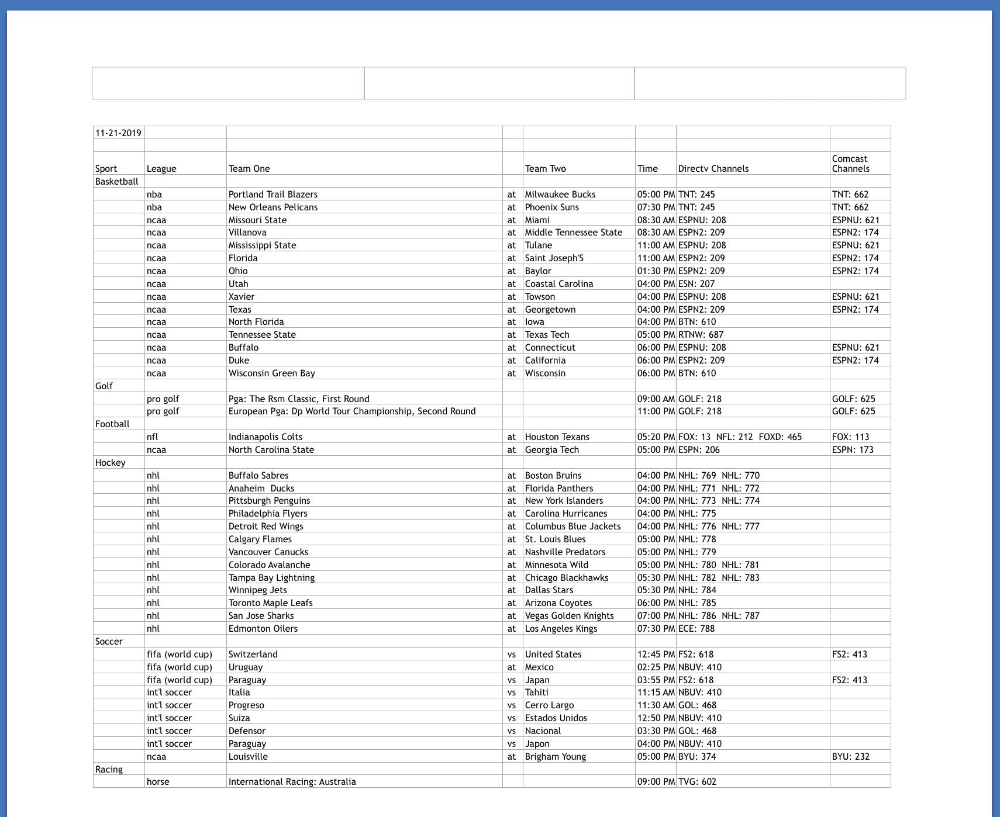

# Game Day Print Outs

> A simple python script that scrapes sports game information for tv and uses openpyxl to print out the information in a simple to use and easy to read format!
>
> Comcast/ Xfinity information is sparce and hard coded due to the information not being easily publicaly avaliable. To access this information, one must log into Comcast/ Xfinity with their account info to even access channel info and lignups locally. 

F1_GO is Written in Python

---------------------------------------
  * [Features](#features)
  * [Requirements](#requirements)
  * [Installation](#installation)
  * [Usage](#usage)
  * [Print Out Example](#Example)

---------------------------------------

## Features
  * Grabs sports games for the day from multiple sources
  * Double checks results for reliable information
  * Neatly and cleanly stores data in an excel sheet
  * Uses the excel sheet to print game information in a clean and uniform manner so that the user can clearly read and find the information they need
  * Runs by area code as to get the correct information

## Requirements
  * Python
  * Python requests
  * html5lib
  * bs4
  * unidecode
  * openpyxl
---------------------------------------

## Installation
Install these python libraries

**Python requests:**
```bash
$ pip install requests
```

**html5lib:**
```bash
$ pip install html5lib
```

**Beautiful Soup:**
```bash
$ pip install bs4
```

**unidecode:**
```bash
$ pip install unidecode
```

**openpyxl:**
```bash
$ pip install openpyxl
```

## Usage
Simply run Game_Day_Print_Out by doing the following

To run *Game_Day_Print_Out*:
```bash
python Game_Day_Print_Out.py [ your_area_code ]
```

where [ your_area_code ] is replaced by your area code such as
```bash
python Game_Day_Print_Out.py 12345
```

## Example

> This is an example excel document of what might be created for the user to print out


